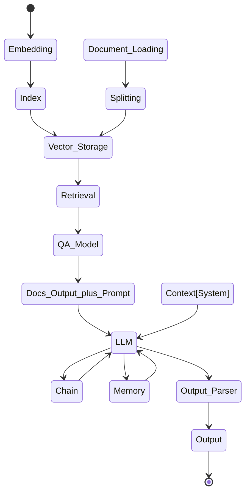
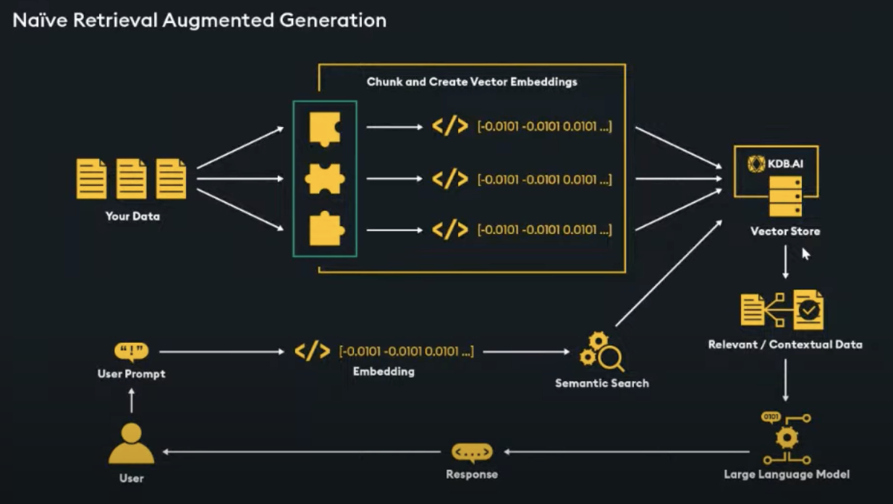
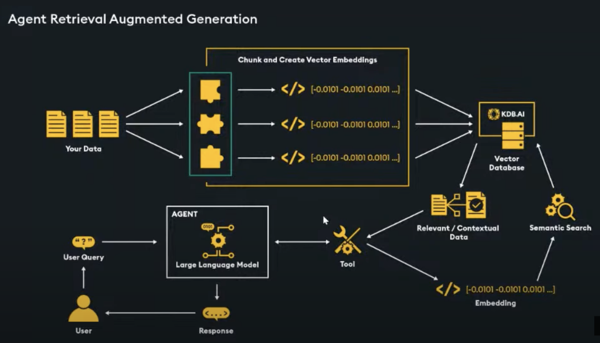
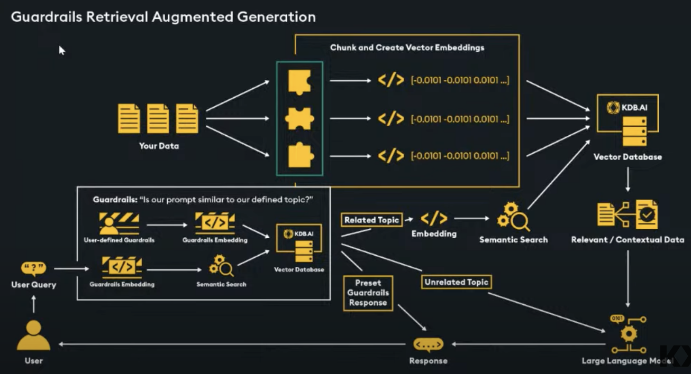
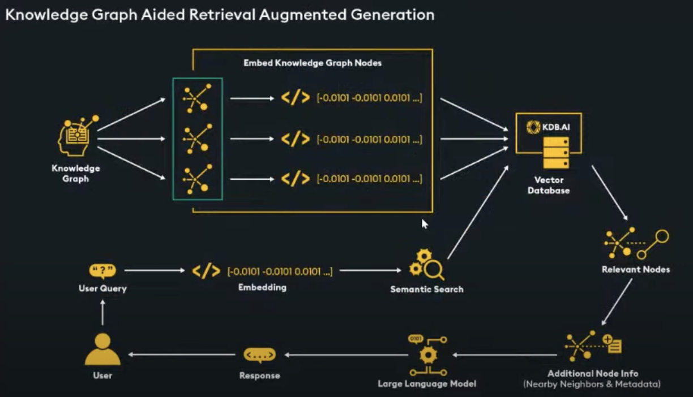

***RAG diagram - 31-05-2024***

---
***RAG approaches***

**Naive approach**

**Agent approach**

**Guardrails approach**

**Knowledge graph approach**

Reference: https://www.youtube.com/watch?v=twM_9CM_3RY

---
***Embeddings***

1. **What are Embeddings?**
   - An **embedding** is a numerical representation of a real-world object, such as words, images, or videos. These representations capture the semantic meaning of the object, making them useful for various applications.
   - For example, consider a sentence like "What is the main benefit of voting?" We can create an embedding for this sentence, represented as a vector (e.g., [0.84, 0.42, ..., 0.02]). This vector encodes the meaning of the sentence.

2. **Types of Embeddings:**
   - **Word Embeddings**: These represent words in a continuous vector space. Word2Vec, GloVe, and FastText are popular word embedding techniques.
   - **Image Embeddings**: Images can be embedded into vectors, allowing us to compare and analyze them. Convolutional neural networks (CNNs) often generate image embeddings.
   - **Document Embeddings**: These capture the meaning of entire documents or paragraphs. Doc2Vec and BERT are examples of document embedding methods.
   - **Graph Embeddings**: Used for graph-structured data (e.g., social networks, knowledge graphs). Graph neural networks (GNNs) create graph embeddings.
   - **Entity Embeddings**: Represent entities (e.g., users, products) in recommendation systems.
   - **Time Series Embeddings**: Useful for time-dependent data (e.g., stock prices, sensor readings).

3. **Applications of Embeddings:**
   - **Search Engines**: Google uses embeddings to match text queries to relevant documents or web pages.
   - **Recommendation Systems**: Embeddings help recommend products, movies, or music based on user preferences.
   - **Chatbots**: Chatbots use embeddings to understand user input and generate contextually relevant responses.
   - **Image Search and Classification**: Image embeddings enable efficient image retrieval and classification.
   - **Social Media**: Platforms like Snapchat use embeddings to serve personalized ads.
   - **Natural Language Understanding**: Embeddings enhance tasks like sentiment analysis, named entity recognition, and text summarization.

Embeddings allow us to bridge the gap between raw data and machine learning models, making them a powerful tool across various domains! 🌟

(1) Getting Started With Embeddings - Hugging Face. https://huggingface.co/blog/getting-started-with-embeddings.

(2) What are embeddings in machine learning? | Cloudflare. https://www.cloudflare.com/learning/ai/what-are-embeddings/.

(3) Embeddings in Machine Learning: Types, Models & Best Practices. https://swimm.io/learn/large-language-models/embeddings-in-machine-learning-types-models-and-best-practices.

(4) The Full Guide to Embeddings in Machine Learning | Encord. https://encord.com/blog/embeddings-machine-learning/.

---
**Commonly used embeddings for natural language and coding:**

1. **Word2Vec**:
   - Developed by Google, Word2Vec employs neural networks to generate word embeddings. It processes a large text corpus and outputs high-quality word vectors⁵.

2. **GloVe (Global Vectors for Word Representation)**:
   - GloVe is another popular word embedding technique. It captures global statistical information from the co-occurrence matrix of words in a corpus³.

3. **FastText**:
   - FastText extends Word2Vec by considering subword information (character n-grams). It's useful for handling out-of-vocabulary words and morphologically rich languages¹.

4. **Doc2Vec**:
   - Doc2Vec creates document embeddings by extending Word2Vec to include paragraph vectors. It captures the meaning of entire documents or paragraphs¹.

5. **BERT (Bidirectional Encoder Representations from Transformers)**:
   - BERT, a transformer-based model, produces contextualized word embeddings. It's pre-trained on a large corpus and fine-tuned for specific tasks¹.

6. **Graph Embeddings (Graph Neural Networks)**:
   - For graph-structured data (e.g., social networks, knowledge graphs), graph embeddings capture relationships between nodes. Graph neural networks (GNNs) create these embeddings¹.

7. **Code Embeddings**:
   - Code embeddings are essential for understanding and searching code. Models like OpenAI's text-similarity and code-search engines provide relevant code embeddings¹.

(1) Understanding Word Embeddings: The Building Blocks of NLP and GPTs. https://www.freecodecamp.org/news/understanding-word-embeddings-the-building-blocks-of-nlp-and-gpts/.
(2) Word Embedding Methods in Natural Language Processing: a Review. https://doaj.org/article/918fe89bfb7a472fa1ac48c6a8c5d212.
(3) Introducing text and code embeddings | OpenAI. https://openai.com/blog/introducing-text-and-code-embeddings/.
(4) Understanding Encoders and Embeddings in Large Language Models ... - Medium. https://medium.com/@sharifghafforov00/understanding-encoders-and-embeddings-in-large-language-models-llms-1e81101b2f87.
(5) Neural Network Embeddings Explained - Towards Data Science. https://towardsdatascience.com/neural-network-embeddings-explained-4d028e6f0526.
(6) https://openai.com/_next/static/chunks/1420.023ea14fc18e2250.js%29.

---
**Practical embeddings associated with each of the platforms provided in Langchain:**

1. **OpenAI**:
   - text-embedding-3-small
   - text-embedding-3-large
   - text-embedding-ada-002

2. **Cohere**:
   - embed-english-light-v2.0
   - embed-english-light-v3.0
   - embed-english-v2.0
   - embed-english-v3.0
   - embed-multilingual-light-v3.0
   - embed-multilingual-v2.0
   - embed-multilingual-v3.0

3. **Anthropic**:
   - **Voyage AI**: While Anthropic itself doesn't provide embeddings, Voyage AI offers a wide variety of options. Their models consider factors like dataset size, architecture, inference performance, and customization.
   - voyage-large-2
   - voyage-code-2
   - voyage-2
   - voyage-lite-02-instruct

4. **Ollama**:
   - mxbai-embed-large
   - nomic-embed-text
   - all-minilm

(1) [OpenAI.] (https://platform.openai.com/docs/models/embeddings)
(2) [Cohere AI.](https://dashboard.cohere.com/playground/classify)
(3) [Anthropic.](https://docs.anthropic.com/en/docs/embeddings)
(4) [Ollama.](https://ollama.com/blog/embedding-models)

---
**Choosing the right embedding model**

1. **Role of Embeddings in AI Applications**:
   - Question Answering (QA):
      Embeddings encode questions and answers into high-dimensional vectors.
      Enables efficient information retrieval for precise answers.
   - Conversational Search:
      Embeddings represent nuances in dynamic conversations.
      Facilitates context-aware information retrieval.
   - InContext Learning (ICL):
      Retrieving context-relevant demonstrations enhances learning efficiency.
      Addresses biases in manual example selection.
   - Tool Fetching:
      Embeddings improve tool recommendations for a user-friendly experience.

2. **Impact of Embeddings on RAG Performance**:
   - Encoder Selection:
      Choose the right encoder for success.
      Low-quality embeddings lead to poor retrieval.
   - Selection Criteria:
      Consider vector dimension, retrieval performance, and model size.
      Custom evaluation on your dataset is essential.
   - Private vs. Public Models:
      Private embedding APIs offer convenience but have scaling limitations.
      Verify rate limits and explore model improvements.
   - Cost Considerations:
      - Querying Cost: Ensure high availability based on model size and latency needs.
      - Indexing Cost: Separate storage for flexibility.
      - Storage Cost: Scales with dimension (e.g., OpenAI’s 1526 dimensions).
      - Search Latency: Opt for low-dimensional embeddings.
      - Language Support: Choose multilingual encoders.
      - Privacy Concerns: Evaluate data privacy requirements.
      - Granularity of Text: Segment large text for relevance and noise reduction.

3. **Types of embeddings**:
   - Dense Embeddings:
      - Dense embeddings are continuous, real-valued vectors that capture overall semantic meaning.
      - Suitable for tasks like dense retrieval and semantic search.
      - Examples include embeddings from models like OpenAI's Ada or sentence transformers.

   - Sparse Embeddings:
      - Sparse embeddings emphasize relevant information by having most values as zero.
      - Beneficial for specialized domains with rare terms (e.g., medical field).
      - Overcome limitations of Bag-of-Words (BOW) models.

   - Multi-Vector Embeddings (ColBERT):
      - Late interaction models where query and document representations interact after encoding.
      - Efficient for large document collections due to pre-computed document representations.

   - Long Context Embeddings:
      - Address challenges in embedding long documents.
      - Models like BGE-M3 allow encoding sequences up to 8,192 tokens.

   - Variable Dimension Embeddings (Matryoshka Representation Learning):
      - Nested lower-dimensional embeddings (like Matryoshka Dolls).
      - Efficiently pack information at logarithmic granularities.
      - Models like OpenAI's text-embedding-3-small and Nomic's Embed v1.5 use this approach.

   - Code Embeddings:
      - Transform how developers interact with codebases.
      - Semantic understanding for code snippets and functionalities.
      - Models like OpenAI's text-embedding-3-small and jina-embeddings-v2-base-code facilitate code search and assistance.

4. **How to Measure Embedding Performance**:
   - Retrieval Metrics and MTEB Benchmark:
      - Retrieval metrics are used to evaluate the performance of embeddings.
      - The **Massive Text Embedding Benchmark (MTEB)** is widely recognized for this purpose.
      - MTEB evaluates embeddings using datasets containing a corpus, queries, and mappings to relevant documents.
      - The goal is to identify pertinent documents based on similarity scores calculated using cosine similarity.
      - Metrics like **nDCG@10** are commonly used to assess performance.

   - Limitations of MTEB:
      - While MTEB provides insights into top embedding models, it doesn't determine the best choice for specific domains or tasks.
      - It's essential to evaluate embeddings on your own dataset to find the optimal model.

   - Chunk Attribution:
      - In scenarios where raw text is available, assessing retrieval-at-generation (RAG) performance on user queries is crucial.
      - **Chunk attribution** helps identify which retrieved chunks or documents were used by the model to generate an answer.
      - An attribution score of 0 indicates that necessary documents weren't retrieved.
      - The average score represents the ratio of utilized chunks at a run level.

5. **Choosing the Right Embedding Model for RAG Systems**:

The process of selecting an optimal embedding model for a Retrieval-Augmented Generation (RAG) system can be enhanced by using chunk attribution to identify which model best fits a specific use case. Galileo’s GenAI Studio offers a practical demonstration using 10-K annual financial reports from Nvidia over the past four years.

- Data Preparation
   - Retrieval and Parsing: The 10-K reports are parsed using the PyPDF library, producing approximately 700 large text chunks.
   - Question Generation: GPT-turbo with a zero-shot instruction prompt generates a question for each chunk. A subset of 100 chunks is randomly selected to ensure questions cover all reports.

- Evaluation Metrics
   - RAG Metrics:
      - Chunk Attribution: Boolean metric indicating whether a chunk contributed to the response.
      - Chunk Utilization: Measures the extent of chunk text used in responses.
      - Completeness: Assesses how much of the provided context was used in generating a response.
      - Context Adherence: Evaluates if the LLM’s output aligns with the given context.

- Safety Metrics:
   - Private Identifiable Information (PII): Flags instances of PII such as credit card numbers and email addresses.
   - Toxicity: Binary classification to detect hateful or toxic information.
   - Tone: Classifies response tone into nine emotional categories.

- System Metrics:
   - Latency: Measures the response time of LLM calls.

- Workflow for Model Evaluation

A function is created to run various sweep parameters, testing different embedding models to identify the optimal one. Steps include:
   - Loading the embedding model.
   - Managing the vector index.
   - Vectorizing chunks and adding them to the index.
   - Loading the chain and defining tags.
   - Preparing Galileo callback with metrics and tags.
   - Running the chain with questions to generate answers.

- Failure Analysis

Instances with an attribution score of 0 (indicating retrieval failure) can be easily identified. For example, failures occurred when chunks mentioned income tax but did not reference the specific year in question.

(1) [Mastering RAG: How to Select an Embedding Model] (https://www.rungalileo.io/blog/mastering-rag-how-to-select-an-embedding-model)

---
***Indexes***

1. **What is a Vector Index?**
    - A **vector index** is a specialized data structure used in computer science and information retrieval.
    - It efficiently stores and retrieves high-dimensional vector data, enabling fast similarity searches and nearest neighbor queries.
    - Vector indexes play a crucial role in applications like generative AI, where semantic context matters.
    - **Reference**: [DataStax Guide](https://www.datastax.com/guides/what-is-a-vector-index)

2. **Purpose of Vector Indexing**:
    - **Search and Retrieval**: Vector indexes allow us to find specific data within large sets of vector representations easily.
    - **Context for Generative AI**: Embeddings (mathematical representations of data) capture object meanings. Vector indexes provide context to generative AI models.
    - **Example**: Imagine an embedding space with dimensions for clothing type and color.
    - **Reference**: [DataStax Guide](https://www.datastax.com/guides/what-is-a-vector-index)

3. **Components of a Vector Index**:
    - **Pre-processing (Optional)**: Vectors may be reduced or optimized before indexing.
    - **Primary Indexing Step (Required)**: Core algorithm for indexing.
    - **Secondary Step (Optional)**: Quantization or hashing to further improve search speeds.
    - **Reference**: [Understanding Vector Index Basics](https://zilliz.com/learn/vector-index)

4. **Vector Databases and Indexing**:
    - **Datastax Astra DB**: Built on Apache Cassandra, it provides a vector index for fast object retrieval and efficient storage of vector embeddings.
    - **Other Vector Databases**: Explore options like Pinecone and Zilliz for vector indexing.
    - **Reference**: [Pinecone](https://www.pinecone.io/learn/vector-database/), [Zilliz blog](https://zilliz.com/learn/choosing-right-vector-index-for-your-project)

(1) What is a Vector Index? An Introduction to Vector Indexing | DataStax. https://www.datastax.com/guides/what-is-a-vector-index.
(2) Everything You Need to Know about Vector Index Basics. https://zilliz.com/learn/vector-index.
(3) Understanding Vector Indexing: A Comprehensive Guide. https://myscale.com/blog/everything-about-vector-indexing/.
(4) Choosing the Right Vector Index for Your Project - Zilliz blog. https://zilliz.com/learn/choosing-right-vector-index-for-your-project.
(5) What is a Vector Database & How Does it Work? Use Cases - Pinecone. https://www.pinecone.io/learn/vector-database/.
(6) What is a vector index?. https://www.gomomento.com/blog/what-is-a-vector-index.
(7) Vector Indexing: A Roadmap for Vector Databases - Medium. https://medium.com/kx-systems/vector-indexing-a-roadmap-for-vector-databases-65866f07daf5.
(8) Understanding Vector Indexing: A Comprehensive Guide. https://medium.com/@myscale/understanding-vector-indexing-a-comprehensive-guide-d1abe36ccd3c.
(9) How to find index of a given element in a Vector in C++. https://www.geeksforgeeks.org/how-to-find-index-of-a-given-element-in-a-vector-in-cpp/.

---
***Databases***

Retrieval Augmented Generation (RAG) combines pretrained Large Language Models (LLMs) with your own data to generate responses. It involves retrieving relevant documents and then using a sequence-to-sequence model to generate outputs. Let's explore the types of databases used in RAG and their advantages and disadvantages:

1. **Vector Databases**:
    - **Description**: Vector databases store document embeddings (dense vectors) representing the content of each document. These embeddings are generated using techniques like BERT, RoBERTa, or other pretrained LLMs.
    - **Advantages**:
        - Efficient retrieval: Vector databases allow fast similarity searches based on vector distances.
        - Compact storage: Document embeddings are space-efficient compared to raw text.
        - Suitable for large-scale retrieval: They handle large collections of documents effectively.
    - **Disadvantages**:
        - Limited expressiveness: Vector embeddings may lose fine-grained details from the original text.
        - Lack of interpretability: It's challenging to understand why certain documents are retrieved.
    - **Commonly Used Vector Databases**:
        - **FAISS**: A popular library for similarity search and clustering using vector embeddings.
        - **Annoy**: Another efficient library for approximate nearest neighbor search.
        - **Pinecone**: Pinecone is a vector database designed specifically for similarity search and nearest neighbor retrieval. It focuses on efficiently storing and querying high-dimensional vector embeddings.

2. **SQL Databases**:
    - **Description**: SQL databases store structured data in tables with rows and columns. In RAG, SQL databases can be used to store metadata or structured information related to documents.
    - **Advantages**:
        - Rich querying capabilities: SQL queries can join tables, aggregate data, and filter results.
        - Integration with existing systems: Many applications already use SQL databases.
    - **Disadvantages**:
        - Schema rigidity: SQL databases require defining relationships and enforcing constraints.
        - Complexity: Setting up and maintaining SQL databases can be intricate.
        - Not optimized for text retrieval: SQL databases are designed for structured data, not natural language text.
    - **Integration Example**:
        - Translate normalized input into SQL parameters via vector space mapping, enabling RAG to correlate user inquiries with relevant database records.

3. **Document Stores (NoSQL)**:
    - **Description**: Document stores (e.g., MongoDB, Elasticsearch) store documents as JSON-like objects. They are schema-less and suitable for unstructured data.
    - **Advantages**:
        - Flexible schema: Documents can have varying structures.
        - Full-text search: Document stores support text-based queries.
        - Scalability: They handle large volumes of data.
    - **Disadvantages**:
        - Lack of transaction support: Not suitable for ACID transactions.
        - Indexing overhead: Indexing large text fields can be resource-intensive.
    - **Example**:
        - Use Elasticsearch to index and search documents for RAG ⁶.

4. **Graph Databases**:
    - **Description**: Graph databases (e.g., Neo4j, Amazon Neptune) model data as nodes and edges, forming a graph structure. Each node represents an entity, and edges denote relationships between entities.
    - **Advantages**:
        - Relationship modeling: Graph databases excel at representing complex relationships, which can be useful for RAG when capturing context or interconnections.
        - Efficient traversals: Queries involving neighbors or paths are optimized in graph databases.
        - Semantic context: Graphs allow expressing semantic connections between documents.
    - **Disadvantages**:
        - Scalability challenges: Graph databases may struggle with large-scale graphs.
    - **Use Case**:
        - Model document similarity based on semantic relationships using graph databases .

5. **In-Memory Databases**:
    - **Description**: In-memory databases (e.g., Redis, Memcached) store data entirely in RAM for fast access.
    - **Advantages**:
        - Lightning-fast retrieval: In-memory databases eliminate disk I/O bottlenecks.
        - Real-time responsiveness: Ideal for RAG scenarios requiring low-latency retrieval.
        - Caching: Use them to cache frequently accessed documents.
    - **Disadvantages**:
        - Limited capacity: RAM size restricts the amount of data that can be stored.
        - Data persistence: In-memory data is volatile; it's lost during restarts.
    - **Application**:
        - Cache document embeddings or intermediate results for RAG .

6. **Hybrid Approaches**:
    - **Description**: Combining multiple database types allows leveraging their strengths while mitigating weaknesses.
    - **Advantages**:
        - Customization: Tailor the solution to your specific RAG requirements.
        - Balance trade-offs: Use vector databases for efficient retrieval and SQL databases for structured metadata.
        - Optimal performance: Achieve a balance between speed and expressiveness.
    - **Disadvantages**:
        - Complexity: Managing hybrid systems can be challenging.
        - Integration effort: Ensure seamless communication between different databases.
    - **Example**:
        - Use a hybrid approach with Elasticsearch (for full-text search) and PostgreSQL (for structured metadata) .

References:
1. [Implementing RAG with Langchain and Hugging Face](https://medium.com/@akriti.upadhyay/implementing-rag-with-langchain-and-hugging-face-28e3ea66c5f7)
2. [RAG Datasets on Hugging Face](https://huggingface.co/rag-datasets)
3. [Integrating RAG with SQL Databases: Techniques and Best Practices](https://borstch.com/blog/development/integrating-rag-with-sql-databases-techniques-and-best-practices)
4. [Optimizing RAG: A Guide to Choosing the Right Vector Database](https://medium.com/@mutahar789/optimizing-rag-a-guide-to-choosing-the-right-vector-database-480f71a33139) ⁶
5. [Graph Databases for Natural Language Processing](https://neo4j.com/blog/graph-databases-natural-language-processing/)
6. [In-Memory Databases: Redis vs. Memcached](https://www.upguard.com/blog/in-memory-databases-redis-vs-memcached)
7. [Optimizing RAG: A Guide to Choosing the Right Vector Database](https://medium.com/@mutahar789/optimizing-rag-a-guide-to-choosing-the-right-vector-database-480f71a33139)
8. [Integrating RAG with SQL Databases: Techniques and Best Practices](https://borstch.com/blog/development/integrating-rag-with-sql-databases-techniques-and-best-practices)
9. [Pinecone Documentation](https://www.pinecone.io/docs/)

(1) Implementing RAG with Langchain and Hugging Face - Medium. https://medium.com/@akriti.upadhyay/implementing-rag-with-langchain-and-hugging-face-28e3ea66c5f7.
(2) Integrating RAG with SQL Databases: Techniques and Best Practices. https://borstch.com/blog/development/integrating-rag-with-sql-databases-techniques-and-best-practices.
(3) Optimizing RAG: A Guide to Choosing the Right Vector Database. https://medium.com/@mutahar789/optimizing-rag-a-guide-to-choosing-the-right-vector-database-480f71a33139.
(4) rag-datasets (RAG Datasets) - Hugging Face. https://huggingface.co/rag-datasets.
(5) A first intro to Complex RAG (Retrieval Augmented Generation). https://medium.com/enterprise-rag/a-first-intro-to-complex-rag-retrieval-augmented-generation-a8624d70090f.
(6) 4 From Simple to Advanced RAG. https://mallahyari.github.io/rag-ebook/04_advanced_rag.html.
(7) Advanced RAG on Hugging Face documentation using LangChain - Hugging .... https://huggingface.co/learn/cookbook/advanced_rag.

---
**Graph databases in a Retrieval Augmented Generation (RAG)**

1. **Advantages of Graph Databases in RAG**:
   - **Context-Rich Data Storage**: Graph databases store information in nodes and edges, capturing relationships and links between data points. This additional context is valuable for RAG.
   - **Navigating Hierarchies**: Graph databases excel at representing hierarchical structures, making them suitable for scenarios where deep hierarchies need to be navigated.
   - **Hidden Connections**: Graph databases reveal hidden connections between items, which can enhance the quality of generated responses.
   - **Discovering Relationships**: Graph databases facilitate the discovery of relationships between items, aiding in generating relevant content.

2. **Use Cases for RAG with Graph Databases**:
   - **Recommendation Chatbot**:
     - Graph databases can power recommendation systems by modeling user-item interactions and capturing preferences.
     - The chatbot can provide personalized recommendations based on user queries.
     - Example: Suggesting relevant products to users based on their preferences¹.
   - **AI-Augmented CRM (Customer Relationship Management)**:
     - Graph databases allow modeling complex customer relationships.
     - The chatbot can assist sales or support teams by providing context-aware responses about customer interactions.
     - Example: Understanding the history of interactions with a specific customer¹.
   - **Behavior Analysis with Natural Language**:
     - Graph databases enable analyzing correlations between data points.
     - The chatbot can analyze customer behavior patterns using natural language queries.
     - Example: Identifying trends or anomalies in customer behavior based on textual descriptions¹.

3. **References**:
   - ¹ [OpenAI Cookbook: RAG with a Graph Database](https://cookbook.openai.com/examples/rag_with_graph_db)

(1) RAG with a Graph database | OpenAI Cookbook. https://cookbook.openai.com/examples/rag_with_graph_db.
(2) Improving RAG performance: Introducing GraphRAG - Lettria. https://www.lettria.com/blogpost/improving-rag-performance-introducing-graphrag.
(3) Graph Data Models for RAG Applications - Graph Database & Analytics. https://neo4j.com/developer-blog/graph-data-models-rag-applications/.
(4) Implementing Graph RAG with NebulaGraph. https://www.nebula-graph.io/posts/implement_graph_rag_with_nebulagraph.

---
**Vector databases in a Retrieval Augmented Generation (RAG)**

1. **Knowledge Expansion**:
   - **Scenario**: When you want to augment a large language model (LLM) with external data to improve contextuality and accuracy.
   - **Why?**: Vector databases allow efficient access to vast information, expanding the LLM's knowledge base.
   - **References**: ¹⁴

2. **Customer Support Chatbots**:
   - **Scenario**: Building chatbots that respond to customer queries.
   - **Why?**: Vector search retrieves relevant passages from a knowledge base, enhancing chatbot responses.
   - **References**: ⁵

3. **Research Literature Review**:
   - **Scenario**: Analyzing research papers to summarize developments in a field.
   - **Why?**: RAG can extract key themes from a literature database using vector search.
   - **References**: ⁵

4. **Text Summarization and Classification**:
   - **Scenario**: When summarizing or classifying text data.
   - **Why?**: Vector databases aid in retrieving relevant content for summarization or classification tasks.
   - **References**: ⁶

5. **Sentiment Analysis**:
   - **Scenario**: Analyzing sentiment in user-generated content.
   - **Why?**: Vector databases help retrieve relevant examples for sentiment analysis.
   - **References**: ⁶

(1) Overview of RAG Approaches with Vector Databases. https://www.youtube.com/watch?v=twM_9CM_3RY.
(2) Optimizing RAG: A Guide to Choosing the Right Vector Database. https://medium.com/@mutahar789/optimizing-rag-a-guide-to-choosing-the-right-vector-database-480f71a33139.
(3) RAG and Vector Search: Better Together for AI. https://www.capellasolutions.com/blog/rag-and-vector-search-better-together-for-ai.
(4) Building a RAG Application using LLM and Vector Database. https://medium.com/@niren.p.pai/building-a-rag-application-using-llm-and-vector-database-555db9a8fbe5.
(5) The Secret Sauce of RAG: Vector Search and Embeddings. https://www.thecloudgirl.dev/blog/the-secret-sauce-of-rag-vector-search-and-embeddings.
(6) Vector Search RAG Tutorial – Combine Your Data with LLMs with Advanced Search. https://www.youtube.com/watch?v=JEBDfGqrAUA.
(7) Evaluating RAG Performance with Vector Databases | BLEU, ROUGE, and RAGAS. https://www.youtube.com/watch?v=yO7-VhtWWno.