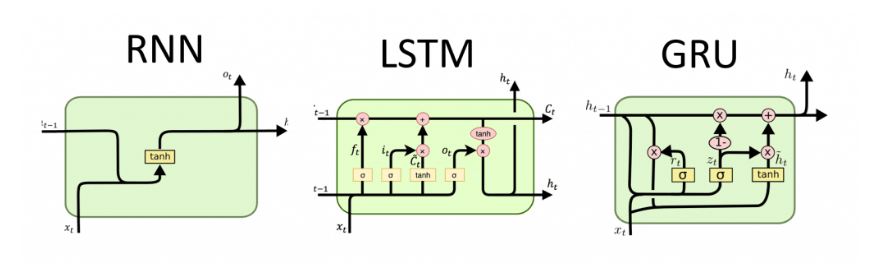

# Large Language Models

Large Language Models (LLMs) are advanced artificial intelligence systems designed to understand and generate human-like text. They are trained on vast amounts of textual data to learn patterns and relationships between words, phrases, and concepts. LLMs use deep learning techniques, particularly variants of neural networks, to process and generate text.

## LLMs Building Path

To build an application using LLMs, we might take into account the following steps:

1.  Data Collection, Storage and Preparation:

    In order for a LLM model to work, predict, classify or provides us with an answer we have to provide it with data from which it can learn and deduce the desired output. We should gather a diverse and extensive dataset relevant to the task we want the LLM to perform. This could include text from various sources such as books, articles, websites, and user-generated content. To be able to store this information we must have a database that can handle large datasets. To pick a database to work withLLMs, there are several factors to consider:

    1. Scalability: The database should be able to scale horizontally to accommodate the growing volume of data. It should support distributed computing and storage to handle large datasets efficiently.
    2. Performance: The database should provide fast read and write operations, especially for complex queries and analytics tasks commonly associated with LLMs.
    3. Flexibility: Given the diverse nature of textual data used in training LLMs, the database should support flexible schema designs to handle varied data structures and formats. It should allow for easy schema evolution and adaptation as data requirements evolve over time.
    4. Reliability: The database should ensure data durability and fault tolerance to prevent data loss or corruption, particularly in distributed environments. It should support mechanisms such as replication, sharding, and automatic failover to maintain data integrity and availability.
    5. Query and Indexing Capabilities: Efficient querying and indexing mechanisms are essential for retrieving relevant subsets of data quickly, especially when dealing with large volumes of text. The database should support full-text search, as well as advanced indexing and query optimization techniques to enhance performance.
    6. Cost: Consider the total cost of ownership, including licensing fees, hardware infrastructure, and ongoing maintenance costs. Choose a database solution that provides a balance between performance and cost-effectiveness, considering the specific requirements of the LLM project.

    Examples of database types that are commonly used for handling large datasets in the context of LLMs include:

    1. NoSQL Databases: NoSQL databases like MongoDB, Cassandra, and Apache CouchDB are well-suited for handling unstructured or semi-structured data, making them a popular choice for storing textual data used in training LLMs. They offer horizontal scalability, flexible schema designs, and high performance for read and write operations.
    2. Columnar Databases: Columnar databases like Apache Parquet, Apache Kudu, and ClickHouse are optimized for analytical workloads, making them suitable for storing and querying large volumes of text data. They provide efficient compression, column-wise storage, and parallel processing capabilities, making them ideal for running analytics and machine learning tasks on LLM datasets. https://www.tinybird.co/blog-posts/what-is-a-columnar-database
    3. Graph Databases: Graph databases like Neo4j and Amazon Neptune are designed for handling interconnected data with complex relationships, making them useful for analyzing and querying text data with rich semantic structures. They provide efficient traversal algorithms and graph-based querying languages for exploring relationships between words, phrases, and concepts in LLM datasets. https://www.datacamp.com/blog/what-is-a-graph-database
    4. Distributed File Systems: Distributed file systems like Hadoop Distributed File System (HDFS) and Amazon S3 are commonly used for storing large-scale datasets, including textual data used in training LLMs. They offer scalable and reliable storage, with support for distributed computing frameworks like Apache Spark and Apache Hadoop for processing and analyzing LLM datasets in parallel. https://www.cohesity.com/glossary/distributed-file-system/

    Ultimately, the choice of database type will depend on factors such as the nature of the data, performance requirements, scalability needs, and budget constraints of our LLM project. It's essential to evaluate the trade-offs and select a database solution that best aligns with our specific requirements and goals.

    Before storing the data on the database of choice, we might have to preprocess the data to clean and normalize it, including tasks such as removing incomplete data, tokenization, lowercasing, removing punctuation, and handling special characters.

2.  Model Selection:

    Based on our requirements and resources we have to choose an appropriate LLM architecture. We need to consider factors such as model size, computational resources needed for training and inference, and performance on relevant tasks.
    
    When selecting a model for working with Large Language Models (LLMs), there are several types of existing models to consider, each with its own characteristics and use cases. Here are some common types of LLMs, along with guidance on how to pick one and examples for each type:

    1. Transformer-Based Models - Transformer-based models, such as OpenAI's GPT (Generative Pre-trained Transformer) series, are among the most popular and powerful LLMs. They utilize self-attention mechanisms to process input data in parallel, allowing them to capture long-range dependencies and relationships in text effectively. Transformer-based models are suitable for a wide range of natural language processing tasks, including text generation, summarization, translation, and question answering. Consider factors such as model size, computational resources required for training and inference, and performance on specific tasks when choosing a transformer-based model.
       Examples:

       - GPT-3 (Generative Pre-trained Transformer 3) by OpenAI
       - BERT (Bidirectional Encoder Representations from Transformers) by Google https://www.coursera.org/articles/bert-model
       - T5 (Text-to-Text Transfer Transformer) by Google https://huggingface.co/docs/transformers/en/model_doc/t5

    2. Recurrent Neural Network (RNN) Models - RNN-based models, such as LSTM (Long Short-Term Memory) and GRU (Gated Recurrent Unit), are capable of capturing sequential dependencies in text data over time. They are particularly effective for tasks involving sequential data, such as language modeling and text generation. RNN-based models are suitable for tasks where the temporal order of data is important, such as sequence prediction, language modeling, and text generation. Consider factors such as model architecture, training stability, and performance on sequential tasks when selecting an RNN-based model.
       Examples:

       - LSTM (Long Short-Term Memory) models https://medium.com/@rebeen.jaff/what-is-lstm-introduction-to-long-short-term-memory-66bd3855b9ce
       - GRU (Gated Recurrent Unit) models https://medium.com/@anishnama20/understanding-gated-recurrent-unit-gru-in-deep-learning-2e54923f3e2
       - Seq2Seq (Sequence-to-Sequence) models
         https://sh-tsang.medium.com/review-empirical-evaluation-of-gated-recurrent-neural-networks-on-sequence-modeling-gru-2adb86559257

         

    3. Transformer + CNN Hybrid Models - Hybrid models combine elements of transformers and convolutional neural networks (CNNs) to leverage their respective strengths. These models often incorporate CNNs for feature extraction from text data before feeding it into transformer layers for further processing. Hybrid models are suitable for tasks where both local and global dependencies in text data are important, such as text classification and sentiment analysis. Consider factors such as model architecture, computational efficiency, and performance on specific tasks when selecting a hybrid model.
       Examples:

       - BERT-CNN by Google https://huggingface.co/docs/transformers/en/model_doc/bert
         https://blog.invgate.com/gpt-3-vs-bert#:~:text=However%2C%20due%20to%20their%20differences,for%20sentiment%20analysis%20or%20NLU.
       - Transformer-XL by Google Brain https://huggingface.co/docs/transformers/en/model_doc/transfo-xl

    4. Memory-Augmented Models - Memory-augmented models, such as the Neural Turing Machine (NTM) and the Differentiable Neural Computer (DNC), incorporate external memory modules to store and retrieve information dynamically during processing. These models are capable of learning and reasoning over structured data more effectively. Memory-augmented models are suitable for tasks requiring complex reasoning and symbolic manipulation, such as question answering and algorithmic problem solving. Consider factors such as memory capacity, read/write operations, and performance on memory-intensive tasks when selecting a memory-augmented model.
       Examples:

       - Neural Turing Machine (NTM) by DeepMind https://medium.com/data-science-in-your-pocket/neural-turing-machines-explained-9acdbe8897de
       - Differentiable Neural Computer (DNC) by DeepMind https://towardsdatascience.com/rps-intro-to-differentiable-neural-computers-e6640b5aa73a

    5. Sparse Attention Models - Sparse attention models, such as Sparse Transformer and Linformer, use sparse attention mechanisms to reduce computational complexity while preserving performance. These models are designed to scale more efficiently to longer sequences and larger datasets. Sparse attention models are suitable for tasks involving long-range dependencies in text data, such as language modeling and text generation. Consider factors such as sparsity pattern, memory efficiency, and performance on large-scale tasks when selecting a sparse attention model.
       Examples:

       - Sparse Transformer by OpenAI https://openai.com/index/sparse-transformer/
       - Linformer by Facebook AI https://serp.ai/linformer/#:~:text=Linformer%20is%20a%20linear%20Transformer%20model%20designed%20to%20make%20transformer,model%20while%20reducing%20computational%20costs.

    When picking a specific model, it's essential to evaluate its performance on relevant tasks, consider the computational resources required for training and inference, and assess any pre-trained versions available for transfer learning. Additionally, consider factors such as model interpretability, robustness to adversarial attacks, and alignment with our project's requirements and constraints.

3.  Training:

    Trainnig the selected LLM on our preprocessed dataset typically involves using large-scale parallel processing hardware (GPUs or TPUs) due to the computational demands of training deep learning models. When training a Large Language Model (LLM), there are several approaches and techniques that can be employed, each with its own impacts and usages. Here are some examples:

    1.  Pre-training from Scratch - In this approach, the model is trained from scratch on a large corpus of text data without any pre-existing knowledge. The entire model architecture is initialized randomly, and the parameters are updated through backpropagation during training.
        Impacts/Usages:

        - Requires a vast amount of labeled text data for effective training.
        - Computationally expensive, as it involves training the entire model from scratch.
        - Suitable for cases where pre-trained models are not available or when the task requires domain-specific knowledge not present in existing pre-trained models.

    2.  Transfer Learning - Transfer learning involves pre-training a model on a large dataset for a related task and then fine-tuning it on a smaller dataset for the target task. The pre-trained model learns general language representations during pre-training, which are then adapted to the specific characteristics of the target task during fine-tuning.
        Impacts/Usages:

        - Reduces the amount of labeled data required for training, as the model leverages knowledge learned from the pre-training task.
        - Improves generalization and performance on the target task by initializing the model with pre-trained weights.
        - Allows for faster convergence during training, as the model starts with learned representations that are already useful for the target task.

    3.  Multi-Task Learning - Multi-task learning involves training a single model on multiple related tasks simultaneously. The model learns to jointly optimize performance across all tasks by sharing parameters and representations between them.
        Impacts/Usages:

        - Improves generalization and robustness by leveraging shared knowledge across multiple tasks.
        - Helps mitigate overfitting by regularizing the model through task-specific and shared representations.
        - Can lead to more efficient use of computational resources by training a single model for multiple tasks instead of separate models for each task.

    4.  Curriculum Learning - Curriculum learning involves training the model on a curriculum of tasks or data samples, starting with simpler tasks or samples and gradually increasing the difficulty over time. This approach guides the model's learning process and helps it to converge more effectively.
        Impacts/Usages:

        - Improves convergence and performance by providing a structured learning schedule that gradually exposes the model to more complex tasks or data samples.
        - Helps prevent the model from getting stuck in local optima by starting with easier optimization problems.
        - Can lead to more efficient use of computational resources by focusing training efforts on the most informative data samples or tasks early in the training process.

    5.  Self-Supervised Learning - Self-supervised learning involves training the model to predict certain properties or features of the input data without explicit supervision. For example, the model may be trained to predict masked words in a sentence or to generate text conditioned on a corrupted version of the input.
        Impacts/Usages:

        - Enables training on large amounts of unlabeled data, as the model generates its own supervision signals during training.
        - Helps the model learn rich and generalizable representations of the input data, which can be transferred to downstream tasks.
        - Can serve as a pre-training stage for transfer learning, providing a strong initialization for fine-tuning on supervised tasks.

    Each of these training approaches has its own strengths and weaknesses, and the choice of approach depends on factors such as the availability of labeled data, computational resources, task requirements, and desired performance metrics. Experimentation and iteration are often necessary to determine the most effective training strategy for a given LLM project.

4.  Deployment:

Deploy the trained model in a production environment, either on-premises or in the cloud.
Design a scalable and efficient infrastructure to handle inference requests, considering factors such as latency requirements, throughput, and resource utilization.
Implement monitoring and logging mechanisms to track model performance, usage patterns, and potential issues in real-time.

5. Integration:

Integrate the LLM into the application or workflow, providing appropriate APIs or interfaces for interacting with the model.
Ensure compatibility with existing systems and data formats, and handle input/output preprocessing as needed.
Evaluation and Iteration:

We should continuously evaluate the performance of the deployed model on relevant metrics, both quantitatively and qualitatively.
Collect feedback from users and stakeholders to identify areas for improvement and prioritize future development efforts.
Iterate on the architecture, data, and model as necessary to address emerging challenges and optimize performance over time
