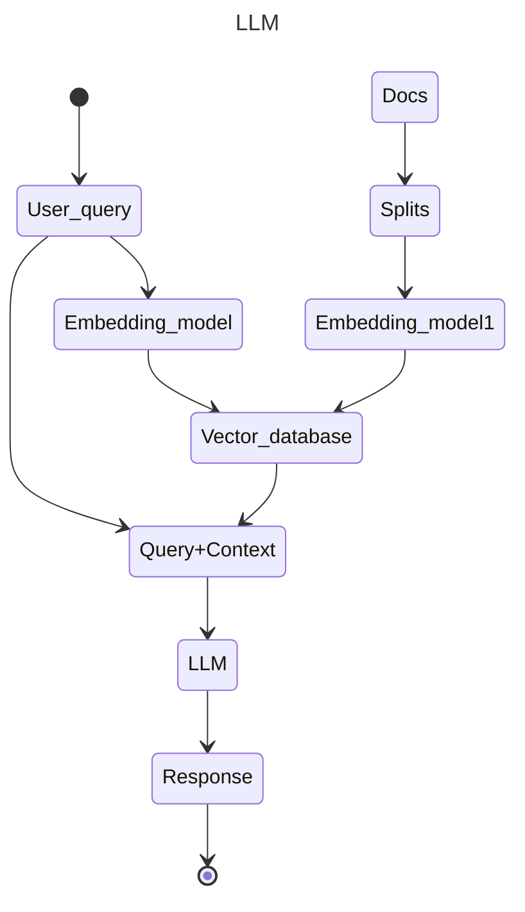

# Introduction to Large Language Models

# 1. List of tools

  **OpenAI API:** The company (OpenAI) provides an API that lets developers interact with their LLMs.
  **Hugging Face Transformers:** The Hugging Face Transformers library is an open source library providing pre-trained models for NLP tasks. It supports models like GPT-2, GPT-3, BERT, and many others.
  **PyTorch:** LLMs can be fine-tuned using deep learning frameworks like PyTorch.
  **LangChain** LangChain is an open source framework designed to simplify the creation of applications using LLMs.

# 2. Different concepts around LLM

Large Language Models (LLMs) are generative AI models that process language and can generate text, including both human-spoken languages and programming languages.
LLMs use deep learning, specifically a neural network architecture called a transformer, to analyze unstructured data and understand how characters, words, and sentences function together.

  **Transformer Model**:
    Transformers are based on the concept of "attention," where certain neurons are more strongly connected (or "pay more attention to") other neurons in a sequence. Each neuron corresponds to a mathematical formula (output = inputs * weights + bias) that is calculated for each word (or part of a word) provided to the model as input and for each word (or part of a word) it generates as output.

      **Tokenization** is the process of breaking a string into its constituent tokens, enabling the model to analyze the input and make predictions.

    When a model is being “trained”, its parameters (weight & biases) are being “tuned” with training data, so that it generates the desired output for a given task.
  
  **Training LLMs**

  1. Pre-training:
     - helps the model learn language syntax, facts, and underlying patterns to accurately predict the next word in a sentence.

    **Back-propagation** algorithm used to calculate the “gradient” of the loss function for the weight & biases in the neural network.

    **Gradient descent** is an optimization algorithm used to minimize the loss function.

  2. Once trained, LLMs can be readily adapted to perform multiple tasks using relatively small sets of supervised data, a process known as fine tuning.

     **Fine-tuning**: is the process where a foundation model’s weights and biases are tuned to a more specific task or domain by providing it with domain-specific training data. This helps the models achieve better performance in narrower domains.

     **Prompt-tuning**:
       - **Few-shot**: give the LLM a few examples as part of the prompt so that it can use them as context and combine them with its own knowledge to better perform on new tasks.
       - **Zero-shot**: refers to giving an LLM a task that was not part of its original training, and seeing how it handles it purely based on its existing knowledge.

**Hallucinations** correspond to the generation of text that seems syntactically correct but is factually incorrect or unfaithful to the source input. These are some strategies to mitigate Hallucinations:
  1. Prompt Engineering: any process that contributes to the development of a well-crafted prompt to generate quality, useful outputs from an AI system;
  2. RAG
  3. Model Parameter Adjustment

**Embeddings**: Creates numerical representations for pieces of text. Text with similar content will have similar vectors.

**Vector_database**: Store, manage and index massive quantities of high-dimensional vector data efficiently.

**Context**: User inputs a question, then its creates an embedding, which is then compared with all the different vectors in the vector store and pick the n most similar. Those n most similar chunks are passed along with the question into an LLM.

**Retrieval Augmented Generation (RAG)** is used in natural language processing (NLP) to enhance the performance of LLMs since your data is loaded and prepared for queries or "indexed". It involves 5 stages:
  1. Loading
  2. Indexing
  3. Storing
  4. Querying
     1. A retriever defines how to efficiently retrieve relevant context from an index when given a query.
          **Semantic Similarity Search** -> take the documents that are most similar to the query in the embedding space; you may miss out on diverse information.

          **Maximum Marginal Relevance (MMR)** -> we send a query in, and then we initially get back a set of responses, with 'fetch_k' being a param that we can control in order to determine how many responses we get. This is based solely on semantic similarity. From there, we then work with that smaller set of docs and optimize for not only the most relevant ones, based on semantic similarity, but also ones that are diverse. And from that set of docs, we choose a final 'k' to return to the user. 

          **SelfQuery** -> useful when you get questions that aren't solely about the content that you want to look up semantically, but also include some mention of some metadata that you want to do a filter on. we use the LLM itself to split that original question into two separate things, a filter and a search term. (Most vector stores support a metadata filter)

          **Compression** -> can be useful to really pull out only the most relevant bits of the retrieved passages. For example, when asking a question, you get back the whole document that was stored, even if only the first one or two sentences are the relevant parts. With compression, you can then run all those documents through a LLM and extract the most relevant segments and then pass only the most relevant segments into a final LLM call. This cames at the cost of making more calls to the LLM, but it's also really good for focusing the final answer on only the most important things.
  5. Evaluation

**LangChain** provides a standard interface  for interacting with a wide range of Large Language Models (LLMs).
  1. Offers a variety of classes and functions designed to simplify the process of creating and handling **prompts**.
  2. Incorporates **memory modules** that enable the management and alteration of past chat conversations.
  3. Has agents that can choose which tools to utilize based on user input.
  4. Uses indexes for organizing documents in a manner that facilitates effective interaction with LLMs.
  5. While using a single LLM may be sufficient for simpler tasks, LangChain provides a standard interface and some commonly used implementations for **chaining** LLMs together for more complex applications.
     1. **LLMChain**: combines llm and prompt
     2. **Simple Sequential Chain**: Single input/output
     3. **Sequential Chain**: takes in multiple chains, where the output of one chain is the input of the next chain
     4. **Router Chain**: decides which subchain it passes to (for example we have multiple prompts for each subject and the router then decides which one is better for each user input)

