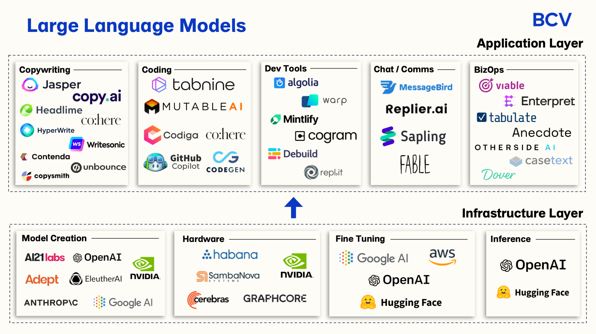

# Large Language Models

Large Language Models (LLMs) are advanced artificial intelligence systems designed to understand and generate human-like text. They are trained on vast amounts of textual data to learn patterns and relationships between words, phrases, and concepts. LLMs use deep learning techniques, particularly variants of neural networks, to process and generate text.

## LLMs Building Path

To build an application using LLMs, we might take into account the following steps:

1. Data Collection, Storage and Preparation:

   In order for a LLM model to work, predict, classify or provides us with an answer we have to provide it with data from which it can learn and deduce the desired output. We should gather a diverse and extensive dataset relevant to the task we want the LLM to perform. This could include text from various sources such as books, articles, websites, and user-generated content. To be able to store this information we must have a database that can handle large datasets. To pick a database to work withLLMs, there are several factors to consider:

   1. Scalability: The database should be able to scale horizontally to accommodate the growing volume of data. It should support distributed computing and storage to handle large datasets efficiently.
   2. Performance: The database should provide fast read and write operations, especially for complex queries and analytics tasks commonly associated with LLMs.
   3. Flexibility: Given the diverse nature of textual data used in training LLMs, the database should support flexible schema designs to handle varied data structures and formats. It should allow for easy schema evolution and adaptation as data requirements evolve over time.
   4. Reliability: The database should ensure data durability and fault tolerance to prevent data loss or corruption, particularly in distributed environments. It should support mechanisms such as replication, sharding, and automatic failover to maintain data integrity and availability.
   5. Query and Indexing Capabilities: Efficient querying and indexing mechanisms are essential for retrieving relevant subsets of data quickly, especially when dealing with large volumes of text. The database should support full-text search, as well as advanced indexing and query optimization techniques to enhance performance.
   6. Cost: Consider the total cost of ownership, including licensing fees, hardware infrastructure, and ongoing maintenance costs. Choose a database solution that provides a balance between performance and cost-effectiveness, considering the specific requirements of your LLM project.

   Examples of database types that are commonly used for handling large datasets in the context of LLMs include:

   1. NoSQL Databases: NoSQL databases like MongoDB, Cassandra, and Apache CouchDB are well-suited for handling unstructured or semi-structured data, making them a popular choice for storing textual data used in training LLMs. They offer horizontal scalability, flexible schema designs, and high performance for read and write operations.
   2. Columnar Databases: Columnar databases like Apache Parquet, Apache Kudu, and ClickHouse are optimized for analytical workloads, making them suitable for storing and querying large volumes of text data. They provide efficient compression, column-wise storage, and parallel processing capabilities, making them ideal for running analytics and machine learning tasks on LLM datasets. https://www.tinybird.co/blog-posts/what-is-a-columnar-database
   3. Graph Databases: Graph databases like Neo4j and Amazon Neptune are designed for handling interconnected data with complex relationships, making them useful for analyzing and querying text data with rich semantic structures. They provide efficient traversal algorithms and graph-based querying languages for exploring relationships between words, phrases, and concepts in LLM datasets. https://www.datacamp.com/blog/what-is-a-graph-database
   4. Distributed File Systems: Distributed file systems like Hadoop Distributed File System (HDFS) and Amazon S3 are commonly used for storing large-scale datasets, including textual data used in training LLMs. They offer scalable and reliable storage, with support for distributed computing frameworks like Apache Spark and Apache Hadoop for processing and analyzing LLM datasets in parallel. https://www.cohesity.com/glossary/distributed-file-system/

   Ultimately, the choice of database type will depend on factors such as the nature of the data, performance requirements, scalability needs, and budget constraints of your LLM project. It's essential to evaluate the trade-offs and select a database solution that best aligns with your specific requirements and goals.

   Before storing the data on the database of choice, we might have to preprocess the data to clean and normalize it, including tasks such as removing incomplete data, tokenization, lowercasing, removing punctuation, and handling special characters.

2. Model Selection:

Choose an appropriate LLM architecture based on your requirements and resources. Common choices include Open AI, Google AI, Cohere, among others.
Consider factors such as model size, computational resources needed for training and inference, and performance on relevant tasks.
According to the problem

3. Training:

Train the selected LLM on your preprocessed dataset. This typically involves using large-scale parallel processing hardware (GPUs or TPUs) due to the computational demands of training deep learning models.
Fine-tune the model on task-specific data if necessary, using techniques like transfer learning to adapt the pre-trained model to your specific use case.

4. Deployment:

Deploy the trained model in a production environment, either on-premises or in the cloud.
Design a scalable and efficient infrastructure to handle inference requests, considering factors such as latency requirements, throughput, and resource utilization.
Implement monitoring and logging mechanisms to track model performance, usage patterns, and potential issues in real-time.

5. Integration:

Integrate the LLM into your application or workflow, providing appropriate APIs or interfaces for interacting with the model.
Ensure compatibility with existing systems and data formats, and handle input/output preprocessing as needed.
Evaluation and Iteration:

Continuously evaluate the performance of the deployed model on relevant metrics, both quantitatively and qualitatively.
Collect feedback from users and stakeholders to identify areas for improvement and prioritize future development efforts.
Iterate on the architecture, data, and model as necessary to address emerging challenges and optimize performance over time
