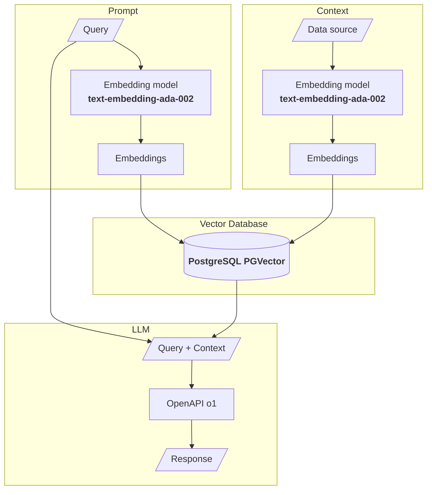
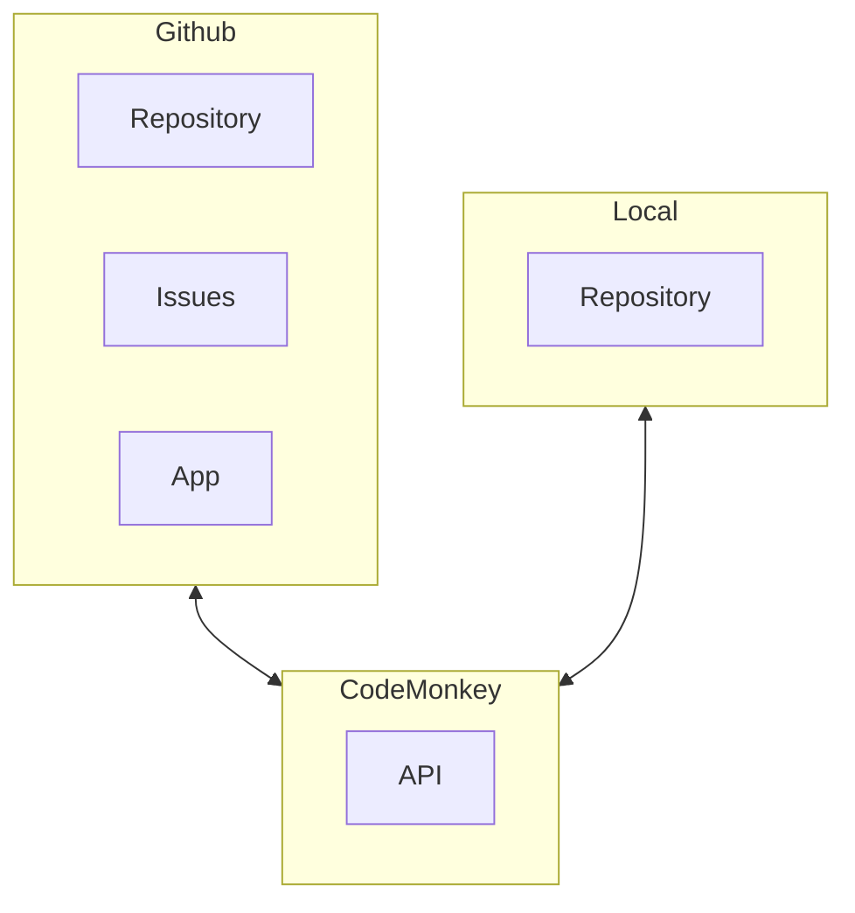

# RAG Architecture

## Challenges

1. Context embeddings creation

    * how are embeddings created? which strategy was used?

2. Query + context

    * Ensure query + context reflect what's intended
    * provides an acceptable answer

3. Include the generated answer in the correct place in the project

## RAG General view

## Integrations

## Embeddings and LLM

| Embeddings | LLM |
| --- | --- |
| text-embedding-ada-002 | OpenAPI o1 | 
| text-embedding-ada-002 | Llama 3.2 (local) | 
