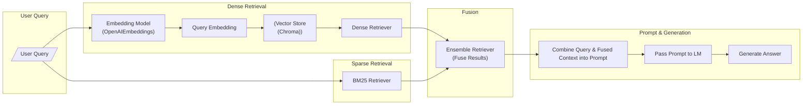
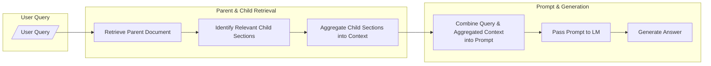
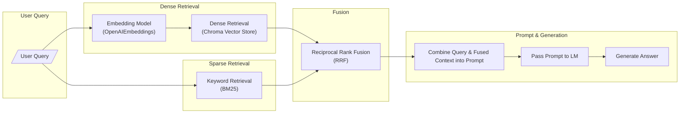
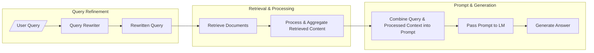
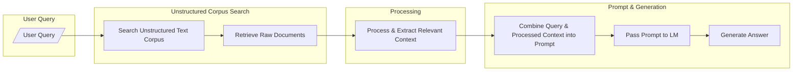

# Introduction

Retrieval-Augmented Generation (RAG) is a powerful approach that combines information retrieval with language generation. At its core, a RAG system retrieves relevant documents or passages based on a user query and then uses these documents as context to generate informed and accurate responses. This method leverages both the vast knowledge stored in external sources and the natural language understanding of modern language models.

Advanced RAG techniques build on this core idea by incorporating additional steps to refine the retrieval process, handle unstructured data, or merge multiple sources of evidence. These techniques address challenges such as:

- Direct Retrieval from Unstructured Data: Techniques like Naive RAG and Unstructured RAG focus on extracting useful information from raw, unsegmented data.
- Combining Multiple Retrieval Signals: Methods like Hybrid RAG and RAG Fusion integrate diverse retrieval approaches to enhance context quality.
- Query Refinement: Approaches such as HyDE RAG and Rewrite-Retrieve-Read use query rewriting or hypothetical document embeddings to better capture the user intent.
- Navigating Document Hierarchies: The Parent Document Retriever effectively handles structured content by isolating relevant sections within large documents.
- Incorporating Additional Context: Contextual RAG enriches the query with extra context (like conversation history) to improve the relevance of the retrieved information.

# Advanced RAG techniques

## 1. Naive RAG

Naive RAG is the baseline approach in the RAG ecosystem. In this method, the user query is first transformed into an embedding (using an embedding model such as OpenAIEmbeddings). This query embedding is then used to retrieve a set of relevant documents or passages from a vector database (e.g., Pinecone or FAISS). The retrieved documents are aggregated into a context that, together with the original query, is passed to a language model (LLM) via a prompt. Finally, the LLM generates the answer based on the combined input.

```mermaid
flowchart LR
    %% Query Processing
    subgraph "Query Processing"
        A[/User Query/]
        A --> B["Embedding Model<br>(OpenAIEmbeddings)"]
        B --> C[Query Embeddings]
    end

    %% Vector Database Retrieval
    subgraph "Vector Database"
        C --> D["(Vector Store<br>(Pinecone/FAISS))"]
        D --> E[Retrieve Relevant Documents]
    end

    %% Context Aggregation & Prompt Formation
    subgraph "Context & Prompt"
        E --> F[Aggregate Retrieved Context]
        F --> G["Formulate Prompt<br>(Query + Context)"]
    end

    %% Language Model
    subgraph "Language Model"
        G --> H[Pass Prompt to LM]
        H --> I[Generate Answer]
    end
```

This diagram reflects the following steps::

- Query Processing: The user query is first encoded into an embedding using a model like OpenAIEmbeddings.
- Vector Database: These embeddings are then used to search a vector database (e.g., Pinecone or FAISS) to retrieve relevant documents.
- Context & Prompt: The retrieved documents are aggregated into a coherent context, which is then combined with the original query to form a prompt.
- Language Model: Finally, this prompt is passed to the language model, which generates the final answer.

## 2. Hybrid RAG

Hybrid RAG combines two retrieval strategies to maximize the relevance and breadth of the retrieved context:
- Dense Retrieval: Uses neural embeddings (e.g., via a vector store like Chroma) to capture semantic similarity between the user query and documents.
- Sparse Retrieval: Employs traditional keyword-based techniques (e.g., BM25) to ensure precise matching based on the query text.

Both retrieval methods run in parallel, and their results are fused using an ensemble retriever (with weighted contributions). The fused context, along with the original query, is then provided to a language model through a prompt. The language model processes this combined input to generate the final answer.

This diagram reflects the following steps:
- User Query: The process starts with the user query.
- Dense Retrieval: The query is first encoded using an embedding model (e.g., OpenAIEmbeddings) to generate a query embedding, which is then used to retrieve documents from a vector store (like Chroma) via a dense retrieval method.
- Sparse Retrieval: In parallel, the query is also processed by a BM25-based retriever for keyword matching.
- Fusion: The outputs from both the dense and sparse retrieval branches are merged using an ensemble retriever that fuses the results based on weighted contributions.
- Prompt & Generation: Finally, the fused context is combined with the original query to form a prompt, which is passed to a language model (LM) to generate the final answer.

## 3. Hyde RAG

HyDE RAG (Hypothetical Document Embeddings) enhances the retrieval process by first using a language model to generate a "hypothetical" answer or document summary based solely on the user query. This hypothetical answer is then encoded into an embedding that represents an ideal response. The system uses this embedding to perform a similarity search in a vector store, retrieving documents that best match the generated ideal. Finally, the retrieved documents are aggregated and combined with the original query to form a context-rich prompt, which is then passed to the language model to generate the final answer.

```mermaid
flowchart LR
    %% User Query Stage
    subgraph "User Query"
        A[/User Query/]
    end

    %% Hypothetical Answer Generation
    subgraph "Answer Generation"
        A --> B["Generate Hypothetical Answer (LM-based)"]
    end

    %% Embedding Encoding
    subgraph "Embedding Encoding"
        B --> C["Encode Hypothetical Answer into Embedding"]
    end

    %% Vector Database Retrieval
    subgraph "Vector Database Retrieval"
        C --> D["(Vector Store)"]
        D --> E[Retrieve Documents via Similarity Search]
    end

    %% Context Aggregation & Prompt Formation
    subgraph "Context & Prompt"
        E --> F[Aggregate Retrieved Documents]
        F --> G["Formulate Prompt <br> (Query + Context)"]
    end

    %% Language Model Generation
    subgraph "Language Model"
        G --> H[Pass Prompt to LM]
        H --> I[Generate Final Answer]
    end
```

This diagram outlines the following steps:
- User Query: The process begins with the user query.
- Hypothetical Answer Generation: The language model generates a "hypothetical" answer based solely on the query, representing an ideal response.
- Embedding Encoding: This hypothetical answer is encoded into an embedding, which captures the essence of the ideal document.
- Vector Database Retrieval: The embedding is used to perform a similarity search in a vector store, retrieving documents that best match the ideal answer.
- Context & Prompt: The retrieved documents are aggregated into a coherent context, which is then combined with the original query to form a prompt.
- Language Model: Finally, the prompt is passed to the language model to generate the final answer.

## 4. Parent Document Retriever

Parent Document Retriever is designed to efficiently handle structured or hierarchical content. In this approach, large documents (parents) are split into smaller, more manageable chunks (children) using different splitting strategies. When a user query is received, the system first retrieves the relevant parent document that broadly covers the topic (using a vector store like Chroma along with an in-memory store for document mapping). It then identifies and extracts the most pertinent child sections from that parent. These child sections are aggregated to form a refined context, which is combined with the original query and passed to the language model (LM) to generate the final answer. This two-phase retrieval ensures that even within large documents, only the most relevant details are used for response generation.

This diagram outlines the following steps:
- User Query: The process begins with the user query.
- Parent & Child Retrieval: The system first retrieves a broad parent document. It then identifies and extracts the most relevant child sections from that parent and aggregates these sections to form a focused context.
- Prompt & Generation: The aggregated context is combined with the original query to form a prompt, which is passed to the language model to generate the final answer.

## 5. RAG Fusion

RAG Fusion is an enhanced version of traditional Retrieval-Augmented Generation (RAG). In this approach, the user query is first used to generate related sub-queries using a language model. These sub-queries, along with the original query, are processed through multiple retrieval channels, such as dense retrieval (via an embedding model like OpenAIEmbeddings with a vector store like Chroma or Qdrant) and sparse keyword-based retrieval (using BM25). Each channel returns a set of relevant documents. The retrieved results are then combined using Reciprocal Rank Fusion (RRF), a technique that reorders and scores the documents based on their relative ranks across the different channels. This produces a unified, comprehensive context. Finally, the unified context is combined with the original query to form a prompt for the language model, which generates the final answer.

This diagram outlines the following steps:
- User Query: The process starts with the user query.
- Dense Retrieval: The query is encoded using an embedding model (e.g., OpenAIEmbeddings) and processed through a vector store (e.g., Chroma Vector Store) to retrieve documents based on semantic similarity.
- Sparse Retrieval: Simultaneously, the query is processed using a BM25-based retriever to fetch documents via keyword matching.
- Fusion: The outputs from both dense and sparse retrieval are merged using Reciprocal Rank Fusion (RRF), which reorders and scores the results to produce a unified context.
- Prompt & Generation: The fused context is then combined with the original query to form a prompt, which is passed to the language model (LM) to generate the final answer.

## 6. Contextual RAG

Contextual RAG enhances the standard retrieval process by incorporating additional context, such as conversation history or user specific information into the query. In this approach, the query is enriched with extra context before being encoded. The enriched query then retrieves documents that are more finely tuned to the user's situation. Additionally, a document compressor (or contextual compression mechanism) is applied to the retrieved documents to filter out irrelevant details, resulting in a concise and focused context. Finally, the refined context is combined with the original query into a prompt, which is passed to the language model (LM) to generate a tailored answer.

```mermaid
flowchart LR
    %% User Query Stage
    subgraph "User Query"
        A[/User Query + Extra Context/]
    end

    %% Enhanced Query Encoding Stage
    subgraph "Enhanced Query Encoding"
        A --> B["Enhanced Query Encoder"]
        B --> C[Generate Enriched Query Embedding]
    end

    %% Retrieval & Compression Stage
    subgraph "Retrieval & Compression"
        C --> D["(Vector Store)"]
        D --> E[Retrieve Contextual Documents]
        E --> F["Document Compressor<br>(Filter & Compress)"]
    end

    %% Prompt Formation & Generation Stage
    subgraph "Prompt & Generation"
        F --> G[Aggregate Refined Context]
        G --> H["Formulate Prompt<br>(Query + Context)"]
        H --> I[Pass Prompt to LM]
        I --> J[Generate Answer]
    end
```

This diagram outlines the following steps:
- User Query: The process starts with the user's query, enriched with extra context (such as conversation history or user-specific details).
- Enhanced Query Encoding: This enriched query is encoded by an enhanced query encoder to generate a precise embedding that captures the broader context.
- Retrieval & Compression: The enriched embedding is used to retrieve relevant documents from a vector store. A document compressor is then applied to these documents to filter out irrelevant details and condense the context.
- Prompt Formation & Generation: The refined context is aggregated and combined with the original query to formulate a prompt, which is then passed to the language model (LM) to generate a tailored answer.

## 7. Rewrite Retrieve Read

Rewrite-Retrieve-Read (RRR) is an advanced retrieval-augmented generation framework designed to handle ambiguous or noisy queries by refining the input before performing document retrieval. In this approach, the original query is first rewritten by a language model to improve its clarity and specificity. The refined query is then used to retrieve relevant documents from a vector store, ensuring that the search is based on a more accurate representation of the user's intent. After retrieval, the gathered documents are processed and aggregated to extract the most pertinent information, forming a concise context. This enriched context is combined with the original query to form a prompt, which is then provided to the language model to generate a well-informed final answer.

This diagram outlines the following steps:
- Query Refinement: The original query is rewritten to be clearer and more targeted.
- Retrieval & Processing: The rewritten query is used to retrieve documents, which are then processed and aggregated to extract the most relevant information.
- Prompt Formation & Answer Generation: The aggregated context is combined with the original query to form a prompt, which is passed to the language model to generate the final answer.

## 8. Unstructured RAG

Unstructured RAG is designed to handle raw, unsegmented data sources that may combine text, tables, and images. In this approach, the user query is used to search through an unstructured text corpus. The retrieval process fetches raw documents or segments that are not pre-organized, and then these documents are processed to extract and aggregate only the most relevant information. This refined, coherent context is subsequently combined with the original query to form a prompt that is passed to the language model, enabling it to generate an informed answer even when the source data is disorganized.

This diagram outlines the following steps:
- User Query: The process starts with the user's query.
- Unstructured Corpus Search: The query is used to search an unstructured text corpus, retrieving raw, unsegmented documents.
- Processing: The retrieved documents are processed to extract and filter out only the most relevant information, forming a concise context.
- Prompt & Generation: The refined context is combined with the original query to create a prompt, which is passed to the language model (LM) to generate the final answer.

# Conclusion

The exploration of these eight advanced Retrieval Augmented Generation (RAG) techniques reveals a vibrant landscape of strategies aimed at enhancing the integration of retrieval and generation processes. Each approach offers unique insights and innovations that collectively advance our understanding and implementation of RAG systems:

- Naive RAG provides a straightforward baseline by encoding a user query, retrieving relevant documents, and aggregating them to guide the language model. It serves as the foundation upon which more advanced techniques are built.
- Hybrid RAG harnesses the complementary strengths of dense and sparse retrieval methods, merging semantic understanding with keyword matching to create a more robust and diversified context.
- HyDE RAG introduces the idea of generating hypothetical answers to produce ideal embeddings that steer the retrieval process, thereby enhancing the relevance of the retrieved documents.
- Parent Document Retriever addresses challenges with hierarchical or structured content by isolating broad parent documents and drilling down to the most relevant child sections, ensuring that only the most pertinent details inform the final answer.
- RAG Fusion leverages multiple retrieval methods and fuses their outputs, often using techniques like Reciprocal Rank Fusion to generate a unified, enriched context that significantly improves answer quality.
- Contextual RAG emphasizes the role of additional context, such as conversation history or user specific details, to refine query encoding and compress the retrieved documents, reducing noise and enhancing precision.
- Rewrite-Retrieve-Read (RRR) refines ambiguous queries through a three step process where the query is first rewritten for clarity, then used for retrieval, and finally processed to extract the most useful information before generating an answer.
- Unstructured RAG adapts RAG methodologies to handle raw, unsegmented data, including mixed content like text, tables, and images, ensuring that even disorganized sources contribute effectively to the final response.

Collectively, these techniques demonstrate that the key to improving RAG systems lies in carefully tailoring the retrieval process to the specific nuances of the data and the query. By refining query representations, merging diverse retrieval signals, and incorporating contextual compression, these methods contribute to generating more accurate, relevant, and cost effective answers. This study not only highlights the breadth of approaches available but also provides a framework for selecting and combining techniques based on the unique challenges of different applications in the evolving field of retrieval augmented generation.

# Additional Insights:

- Transitioning from Naive to Hybrid RAG: Our current implementation follows the Naive RAG approach. Moving to Hybrid RAG is straightforward, by adding a sparse retrieval component and fusing its results, we can achieve a richer context.
- Hybrid vs. RAG Fusion: Hybrid RAG typically uses a fixed or weighted fusion of the two, whereas RAG Fusion refines the process by generating sub queries and applying Reciprocal Rank Fusion to dynamically rank and merge results.
- Hyde works by creating a draft answer based on the question, and then uses that draft to find documents that match its ideas. In contrast, RAG Fusion makes extra related questions from the original query and uses those to sort and rank the documents it retrieves.